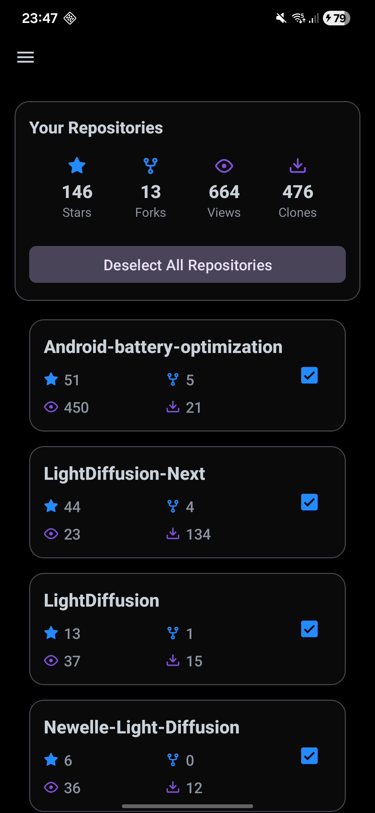

# Star Notifier

[](https://opensource.org/licenses/Apache-2.0)
[](https://github.com/Aatricks/Star-Notifier/issues)
[](https://github.com/Aatricks/Star-Notifier/stargazers)

A GitHub star and fork notifier Android app made for anxious developers who want to know immediately when their repositories gain attention.

<p align="center">

</p>

## ✨ Features

- **Real-time Notifications**: Get instant push notifications when your GitHub repositories receive new stars or forks
- **Traffic Monitoring**: Track repository views and clones with lifetime totals
- **Selective Monitoring**: Choose which repositories to monitor from your GitHub account
- **Background Monitoring**: Automatic checks every 15 minutes using Android WorkManager
- **Repository Totals**: View total stars, forks, views, and clones across all selected repositories
- **GitHub-Inspired UI**: Modern Material Design 3 interface with GitHub's color palette and Octicons
- **AMOLED Support**: Pure black theme for AMOLED displays
- **Privacy Focused**: Uses GitHub's public API - no private repository access required
- **Material Design**: Modern Android UI following Material Design 3 guidelines

## Installation

### Build from Source

1. Clone the repository:
```bash
git clone https://github.com/Aatricks/Star-Notifier.git
cd Star-Notifier
```

2. Open the project in Android Studio

3. Build and run on your device:
```bash
./gradlew installDebug
```

## Setup

1. **Launch the app** after installation
2. **Grant notification permissions** when prompted
3. **Open the configuration sidebar** using the hamburger menu (☰) in the top-left corner
4. **Enter your GitHub username** in the settings screen
5. **Add a personal access token** (optional, for private repositories):
   - Go to [GitHub Settings > Developer settings > Personal access tokens](https://github.com/settings/tokens)
   - Generate a new token with `public_repo` scope
   - Paste the token in the app settings
6. **Select repositories** to monitor from the list (sorted by stars, shows repo name)
7. **Save configuration** and start monitoring!

## Usage

### Background Monitoring
- The app automatically checks for changes every 15 minutes
- Notifications appear when repositories gain stars or forks
- No manual intervention required once configured

## Testing

### Unit Tests
```bash
./gradlew testDebugUnitTest
```

### Instrumentation Tests
```bash
./gradlew connectedDebugAndroidTest
```

### Manual Testing
1. Configure the app with your GitHub credentials
2. Star/fork your test repositories to trigger real notifications

## Technical Details

### Architecture
- **MVVM Pattern**: Clean separation of concerns with ViewModels and LiveData
- **Repository Pattern**: Centralized data access layer
- **WorkManager**: Reliable background task scheduling
- **Retrofit + OkHttp**: HTTP client for GitHub API integration
- **SharedPreferences**: Local data persistence
- **Material Design 3**: Modern UI with DrawerLayout navigation and GitHub-inspired theming

### Key Components
- `SettingsActivity`: Main configuration screen with navigation drawer
- `GitHubCheckWorker`: Background monitoring worker
- `NotificationHelper`: Android notification management
- `TestBroadcastReceiver`: ADB command handler for testing

### Dependencies
- **AndroidX**: Core Android libraries
- **WorkManager**: Background task scheduling
- **Retrofit**: HTTP client
- **Material Components**: UI components
- **Gson**: JSON parsing

### API Usage
- **GitHub REST API v3**: Public repository information and traffic data
- **Rate Limits**: Respects GitHub's API rate limits (60 requests/hour for unauthenticated, 5000 for authenticated)

## Contributing

1. Fork the repository
2. Create a feature branch: `git checkout -b feature/amazing-feature`
3. Commit your changes: `git commit -m 'Add amazing feature'`
4. Push to the branch: `git push origin feature/amazing-feature`
5. Open a Pull Request

### Development Guidelines
- Follow Kotlin coding conventions
- Write unit tests for new features
- Update documentation for API changes
- Test on multiple Android versions

---

**Made for anxious people, by anxious people.**
